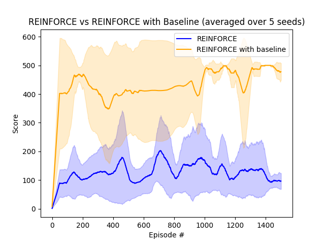

# Policy Gradient
Implementation of the following Policy Gradient Algorithms - Reinforce and Actor Critic. Some parts adapted from https://github.com/andrecianflone/rl_at_ammi .
## Reinforce
### Reinforce vs Reinforce with Baseline

### Video of Gameplay - Reinforce Algorithm for the Lunar-Lander environment
[](https://youtu.be/_nrSvgQYAl4 "Reinforce Algorithm for the Lunar-Lander environment")

## Actor-Critic
### Video of Gameplay - Actor-Critic implementation for Bipedal walker
[](https://youtu.be/4G7x6_DeoTA "Actor-Critic implementation for Bipedal walker")

## How to run
### Create a new environment
Example: 
```
conda create -n policy_grad
``` 

### Install Dependencies
```
pip install -r requirements.txt
```
### To use `gym.wrappers.Monitor` to record the last episode
```
sudo apt-get install ffmpeg
```
### Reinforce
Without baseline
```
python reinforce.py
```

With baseline
```
python reinforce_with_learned_baseline.py
```
### Actor-Critic 
Run Training from Scratch
```
python actor_critic.py
```
Use a trained agent
```
python actor_critic.py --load-model
```
